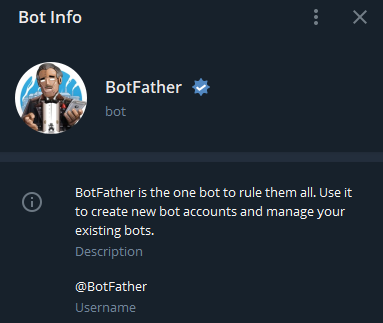

<!-- Template: https://github.com/othneildrew/Best-README-Template -->

[![LinkedIn][linkedin-shield]][linkedin-url] [![Github][github-shield]][github-url]

<!-- PROJECT LOGO -->
<br />
<p align="center">
  <a href="https://github.com/v1et4nh/PriceScraper-Telegram-Bot">
    
  </a>

  <h3 align="center">PriceScraper-Telegram-Bot</h3>

  <p align="center">
    A pricescraper for <a href="https://www.flaschenpost.de">flaschenpost.de</a>
    <br />
    Price alert send via Telegram
    <br />
    <br />
  </p>
</p>

<!-- TABLE OF CONTENTS -->
<details open="open">
  <summary>Table of Contents</summary>
  <ol>
    <li>
      <a href="#what-is-the-project-about-and-why">What is the Project about and why?</a>
    </li>
    <li>
      <a href="#getting-started">Getting Started</a>
      <ul>
        <li><a href="#telegram-bot-configuration">Telegram Bot Configuration</a></li>
        <li><a href="#installation">Installation</a></li>
      </ul>
    </li>
    <li><a href="#configuration-and-usage">Configuration and Usage</a></li>
    <li><a href="#contact">Contact</a></li>
    <li><a href="#sources">Sources</a></li>
  </ol>
</details>


<!-- ABOUT THE PROJECT -->
# What is the Project about and why?
Because I am super lazy I use the service of beverage delivery directly to my door. 
There is only one company in my region: The german www.flaschenpost.de (No Affiliate-Link :P) 
Sometimes it's even cheaper to order on their website than buying in the supermarket. 
But as I already mentioned, I am super lazy and I also don't really want to look up for their super deals all over again..
That's why I started this little project to save my valuable time 
(and maybe also to improve my programming skills. Nice!).

Here is my idea:
* Get the price from www.flaschenpost.de with a webscraper
* If the price falls below a certain amount -> send me a message on telegram
* Message content: Beverage + Price + Url (+ Screenshot of the current page)

And here are my steps:
* Use Python because it's easy
* Use Selenium to navigate through the website and get the price
* Use Telegram API to send me messages and images

<!-- GETTING STARTED -->
# Getting Started
So before we jump in, we first need to configure our Telegram Client or Bot...

## Telegram Bot Configuration
* Obviously you need a Telegram Account, so go get the app and create a new account
* Once you've installed the app and registered, you need to create your own bot. <br>
  Simply search for `@BotFather`: <br>
<p align="center"></p>

### Create new Bot and get `bot_token`
* Send him a "/start" message or press the Start Button and create a new bot by sending "/newbot"
* Follow the instructions to define a username (which will be displayed in your app) and a unique botname
* Be sure to save the API Token (which is shown after this: "Use this token to access the HTTP API") <br>
  That will be your `bot_token` for later

### Get `bot_chatID`
* Now search for your bot (the username you just created) in your telegram app
* Send a "/start" message or press the Start Button to create a chat with your bot
* Open a new tab and enter `https://api.telegram.org/bot<yourtoken>/getUpdates`
* Replace `yourtoken` with the `bot_token`
* Assume the `bot_token` = 123abc456, then the target address would look like this: <br>
  `https://api.telegram.org/bot123abc456/getUpdates`
* You will see a json-like format. Look for `"id"`. That is your `bot_chatID` <br>
Note: You will only see the ID once you send your bot the "/start" message <br> <br>
That's it for now. Keep both your `bot_token` and `bot_chatID` ready for later :)

## Installation
### Clone the repo
   ```shell script
   git clone https://github.com/v1et4nh/PriceScraper-Telegram-Bot
   ```
### Virtual Environment
This chapter is optional but I highly recommend to use it in order to keep your projects tidy.
* Create a new virtual environment in the repo
    ```shell script
    $ virtualenv venv
    ```
* Activate the new created virtual environment `venv`
    ```shell script
    # Windows
    $ venv\Scripts\activate.bat
  
    # Unix
    $ source venv//bin/activate
    ```
* If the virtual environment is activated correctly, your console should look like this:
    ```shell script
    $ (venv)  
    ```

### Dependencies
Install the required dependencies for this project
```shell script
# Virtual environment
$ (venv) pip install -r requirements.txt
  
# Without virtual environment
$ pip install -r requirements.txt
```
 
## Configuration and Usage
* I highly recommend to create a `.env`-file to store your `bot_token` and `bot_chatID` in there:
    ```.env
    TELEGRAM_BOT_TOKEN  = <yourtoken>
    TELEGRAM_BOT_CHATID = <yourchatID>
    ```
    In this way, sensitive information like your token or ID are hidden, 
    so no one has access to it if you intend to share your project on github. <br>
    Just add the `.env`-file to your `.gitignore` and it won't be considered by git. <br>
    Otherwise, if you only use this locally, you can also just insert your `bot_token` and `bot_chatID` directly in the `main.py`-sourcecode:
    ```python
    15 # Load environment variables
    16 load_dotenv()
    17 bot_token  = <yourtoken>    # Replace with your own bot_token
    18 bot_chatID = <yourchatID>   # Replace with your own bot_chatID
    ```

* Adjust the zipcode to your personal one in `__init__`:
    ```python
    54 self.zipcode = '48151'  # 48151 is an example
    ```
  or add it to your `.env`-file (recommended):
    ```.env
    TELEGRAM_BOT_TOKEN  = <yourtoken>
    TELEGRAM_BOT_CHATID = <yourchatID>
    ZIPCODE             = 48151
    ```
  and use this line of code instead:
    ```python
    54 self.zipcode = os.getenv('ZIPCODE')
    ```

* Adjust the names, urls and pricetrigger in `if __name__ == "__main__"` to your personal preferences:
    ```python
    # (name, url, pricetrigger)
    list_beverage = [('Volvic', 'https://www.flaschenpost.de/volvic/volvic-naturelle', 5),
                     ('Spezi', 'https://www.flaschenpost.de/paulaner-spezi/paulaner-spezi', 10),
                     ('FritzKola', 'https://www.flaschenpost.de/fritz-kola/fritz-kola', 18)]
    ```
  If the price falls below the pricetriger, a message will be sent to your telegram account. <br>
  For testing purposes, set your pricetrigger to a high value to definitely trigger an alert.
  
* For testing & debug purposes unhide your browser to observe the steps made by the script by changing the parameter `run_background` to False:
    ```python
    flaschenpost = Flaschenpost(list_beverage=list_beverage, run_background=False)
    ```

Once everything is set up, you can run the script and see what happens: <br>
```shell script
$ (venv) python main.py
```

<!-- Describe how to send messages regularly -->
## Running the script regularly
tbd; Stay tuned


<!-- CONTACT -->
# Contact
[![LinkedIn][linkedin-shield]][linkedin-url] [![Github][github-shield]][github-url]

Please share your thoughts and connect with me on [linkedin](https://linkedin.com/in/viet-anh-le-cong) 

Viet Anh Le Cong - [@linkedin](https://linkedin.com/in/viet-anh-le-cong) - hello@v1et4nh.de

Project Link: [https://github.com/v1et4nh/PriceScraper-Telegram-Bot](https://github.com/v1et4nh/PriceScraper-Telegram-Bot)

# Sources
* [Medium: Man Hay Hong](https://medium.com/@ManHay_Hong/how-to-create-a-telegram-bot-and-send-messages-with-python-4cf314d9fa3e)
* [Official Telegram Bot Homepage](https://core.telegram.org/bots)

<!-- MARKDOWN LINKS & IMAGES -->
<!-- https://www.markdownguide.org/basic-syntax/#reference-style-links -->
[github-shield]: https://img.shields.io/github/followers/v1et4nh?label=Github&style=for-the-badge
[linkedin-shield]: https://img.shields.io/badge/-LinkedIn-black.svg?style=for-the-badge&logo=linkedin&colorB=555
[github-url]: https://github.com/v1et4nh
[linkedin-url]: https://linkedin.com/in/viet-anh-le-cong
